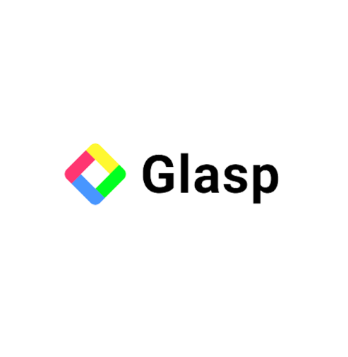
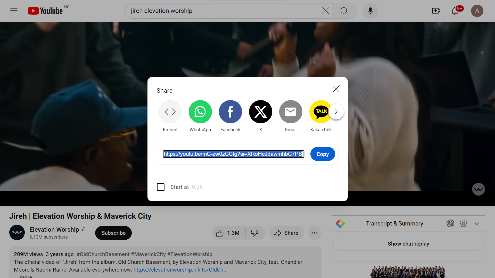

# GLASP:YOUR ULTIMATE TOOL FOR HIGHLIGHTING, ORGANIZING, AND COLLABORATING ON THE WEB

## <ins> TABLE OF CONTENT
### Introduction
* ##### About Glasp
* ##### Usefulness of Glasp
### Guides
* ##### Glasp For Materials
&nbsp;**_Step 1- Create an account_**
&nbsp;**_Step 2- Installing the extensionn on windows browser_**
&nbsp;**_Step 3- Finding the material_**
&nbsp;**_Step 4- Opening highlights_**
  * ##### Glasp For YouTube Videos
&nbsp;**_Step 1- Install Glasp browser extension_**
&nbsp;**_Step 2- Copy video link_**
&nbsp;**_Step 3- Open Chrome browser_**
&nbsp;**_Step 4- Highlight specific moments_**
&nbsp;**_Using Chrome_**

### Features
&nbsp;**Glasp Features**

### Conclusion
&nbsp;**Wrapping up the article**

#### INTRODUCTION  

knowledge is gained in two ways: Using visuals and audios. We make use of various elements like our phones, tablets, computers, printed articles, and the likes in acquiring knowledge.

Sometimes, we take notes on what we learn. These notes can be taken in printed material context by writing on paper or in digital context, by highlighting. Highlighting simply means laying emphasis on something important. We will be focusing on the digital aspect of this note-taking. A very good tool we can use for highlighting is Glasp.

##### ABOUT GLASP

Glasp is a website highlighting tool. It is a powerful tool for building a knowledge network. It is primarily designed for use with web articles and online contents.

It is compatible with a variety of apps and services, including YouTube videos, kindle, PDFs.

It allows users to import highlights and notes directly from these apps into Glasp. 

This will be explained practically as we proceed. Glasp is a free tool which means users can use it after downloading at no cost at all. 

It works more on desktop devices and requires an internet connection to be able to access. 

It can be downloaded with a web browser as either chrome or safari extension, i.e. Glasp Chrome Extension or Glasp Safari Extension. Its extension is first downloaded and installed into the computer before it can be made use of.

##### USEFULNESS OF GLASP/ HOW GLASP WORKS

Glasp Chrome Extension is used to highlight texts on PDFs and websites and also organizes quotes and ideas from any web page without leaving the page you are reading. This highlight is made by double clicking the text on your computer. Glasp helps users find what is of utmost importance while in the process of reading, making note-taking super easy and time efficient.

It organizes research and learning notes in an accessible library for everyone. Users can create private groups to accommodate a specific number of individuals and can also create a wider audience to share and collaborate on research.

This helps you gain more knowledge from what others have to contribute. You also have the privilege of viewing other articles made by individuals, and leave notes.

#### STEP-BY-STEP GUIDE	

##### <ins>_How Glasp works for article_ 

Here is a video tutorial on navigating glasp
You can check it out for a much clearer explanation.
<video controls src="WhatsApp Video 2024-04-29 at 02.52.49_ae3edd91.mp4" title="Glasp tutorial"></video>

**Step 1: Create an account**
To begin, open the Chrome browser on your computer.  Type in [glasp.co](www.glasp.co) on the search bar and you will automatically be redirected to glasp official site.
Once on the Glasp website, locate the option to _"Add to Chrome"_ and click on it. A prompt will appear asking if you want to add glasp to your desktop. 

Click _"Add to desktop"_ to proceed.

**Step 2: Installing the Extension on Windows Browser**
After installing the Glasp extension, find the extension menu and select _"Sign up"_. Enter your correct email and a strong password. Once logged in, choose your favorite topics to engage with on Glasp. 
Note that not all your favorite topics may be available, and you can always change them later.

**Step 3: Finding an article** 
Go to _"Dashboard"_ and click on _"Home"_. You would find your selected topics behind _"Your Topics"_ option at the top left of your computer. Click on any of the topics and pick an article you wish to read. You can also edit these topics by clicking _"Edit"_ just at the front of _"Your Topics"_.

You can then begin highlighting upon seeing sentences that catch your attention. Highlighting is done by double clicking a text in the sentence. Immediately you do this, a color option will pop-up so you can select the highlight color from the Glasp pop-up tool.

 

**Step 4: Opening Highlights**
To view your highlights, return to the Home page and click on _"My Highlight"_ at the top left of your computer, close to _"Home"_.

You can add extra notes to your highlights, gathering ideas from both yourself and others on the same article. Adding tags can help organize them, and comments aid in summarizing.

You can share your highlights with anyone. Creating a group allows you to invite others to join and share thoughts and ideas, facilitating the discovery of interesting ideas and new connections.

##### <ins>_How Glasp works for Video content_ 
Glasp can be used in highting texts on YouTube videos.

Annotating YouTube videos with Glasp adds an interactive dimension to your video-watching experience, allowing you to highlight key moments and make personalized notes. In this guide, we'll walk you through the process of annotating YouTube videos using Glasp in the YouTube app.
Here is a quick video tutorial for a much clearer explanation 
<video controls src="WhatsApp Video 2024-04-29 at 00.20.51_6d2ded16.mp4" title="Glasp for YouTUBE" type="video/mp4"></video>

**Step 1: Install Glasp Browser Extension**
Before you begin annotating videos in the YouTube app, ensure that you have the Glasp browser extension installed on your Chrome browser.

**Step 2: Copy Video Link**
Once you have confirmed that your extension has been installed, go to your YouTube app and click on any video of your choice. 
While watching a YouTube video in the app, locate the _"Share"_ button below the video player. Tap on it and select _"Copy link"_. This action copies the video link to your device's clipboard, ready for pasting.

**Step 3: Open Chrome Browser**
Switch to your Chrome browser and paste the copied link into the address bar. Hit enter, and the YouTube video will load in your browser window. This step allows you to access the video within the Glasp environment, enabling annotation functionalities.

**Step 4: Highlight Specific Moments**
With the video now loaded in Chrome, you can start annotating specific moments using the Glasp extension.
Click on the Glasp icon in your browser toolbar to access the annotation tools. You can highlight key points, add comments, and create tags to organize your annotations effectively. 

Annotating YouTube videos with Glasp in the YouTube app is a straightforward process that enhances your video-watching experience. By following the steps outlined in this guide, you can make personalized notes, highlight important moments, and engage with the content in a more meaningful way. So next time you're watching a YouTube video on your mobile device, remember to leverage Glasp for an interactive and insightful viewing experience. 

**Using Chrome**
There is an alternative way of highlighting YouTube videos without having to go to the app, copying link and then pasting on your browser. 
Here is a very quick guide

1. Install the Glasp extension and login to your account.
2. Open a YouTube video in your browser.
3. Highlight specific moments of the video using the Glasp extension.
4. Once you've created a highlight, you can add a note or comment to it and save it to your Glasp library. Just like with web content, you can search, tag, and organize your YouTube highlights and notes in your Glasp library.

It's important to remember that Glasp is a tool to help you learn and organize information, so use it in a way that works best for you.

#### FEATURES

Glasp has varieties of features. They include: 
* 	The very obvious one, which is to highlight text on web. Glasp helps organizes your highlights 
*	It makes notes with tags 
*	It is an automatic AI-powered summarizer which summarizes any webpage, PDF, or YouTube videos with AI. This AI feature helps you find relevant highlights and notes based on keywords and phrases. 
* 	It exports highlights and notes taken in Markdown, HTML, CSV, and JSON formats. 
*	It imports highlights and notes made on different apps to Glasp 
*	Glasp send you daily reminder to review these highlights and notes
*	It creates and shares quotes from your highlights. 
*	It helps keeps tracks of progress. 

#### CONCLUSION

You now know how to use Glasp for both web contents and YouTube videos and that’s basically all there is to know about Glasp.  Just remember to install the browser extension, highlight the content you want to remember, and add your notes or comments. Then, you can easily search, tag, and organize all your highlights and notes in your Glasp library. If you're interested in building a knowledge network, Glasp is definitely worth checking out!

Thank you for sticking with me and learning more about Glasp! 

Cheers 🥂
